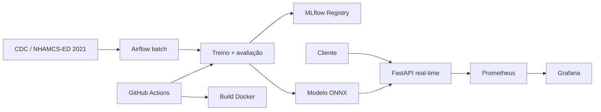

# Hospital Triage — FIAP Tech Challenge Fase 3

[](https://github.com/jrrrtricolor/FIAP-fase3-hospital-triage/actions/workflows/ml-pipeline.yml)

Sistema acadêmico de apoio à triagem hospitalar. A API recebe texto clínico em
inglês e retorna uma das classes `normal`, `atencao` ou `urgente`.

> O projeto é um demonstrador acadêmico. Não realiza diagnóstico, não define
> conduta clínica e não substitui profissionais de saúde.

## Entrega

| Item | Link |
|---|---|
| Repositório público | [github.com/jrrrtricolor/FIAP-fase3-hospital-triage](https://github.com/jrrrtricolor/FIAP-fase3-hospital-triage) |
| Branch da entrega | [`main`](https://github.com/jrrrtricolor/FIAP-fase3-hospital-triage/tree/main) |
| CI/CD | [GitHub Actions](https://github.com/jrrrtricolor/FIAP-fase3-hospital-triage/actions/workflows/ml-pipeline.yml) |
| Vídeo STAR | **PENDENTE — inserir URL pública antes da entrega** |
| Model Card | [docs/model_card.md](docs/model_card.md) |

## Roteiro do avaliador

### 1. Subir o projeto completo

Pré-requisitos: Git, Docker 24+ e Docker Compose v2. A primeira construção do
Airflow pode levar alguns minutos e consumir alguns gigabytes em disco.

```bash
git clone https://github.com/jrrrtricolor/FIAP-fase3-hospital-triage.git
cd FIAP-fase3-hospital-triage
git switch main
docker compose up --build -d
docker compose ps
```

Quando os serviços estiverem saudáveis:

| Serviço | Endereço | Verificação |
|---|---|---|
| API FastAPI | [localhost:8000/docs](http://localhost:8000/docs) | documentação OpenAPI |
| Airflow | [localhost:8080](http://localhost:8080) | DAG `hospital_triage` |
| Prometheus | [localhost:9090/targets](http://localhost:9090/targets) | target `hospital_triage` ativo |
| Grafana | [localhost:3000](http://localhost:3000) | `admin` / `admin` |

### 2. Testar a API

```bash
curl --fail http://localhost:8000/health
curl --fail http://localhost:8000/ready
curl --fail \
  --header 'Content-Type: application/json' \
  --data '{"clinical_text":"Severe chest pain and shortness of breath."}' \
  http://localhost:8000/predict
```

O `POST /predict` retorna a classe, as probabilidades, a versão do modelo e a
latência da inferência. A API carrega uma única vez o ONNX empacotado e não
registra o texto clínico em logs ou métricas.

Endpoints disponíveis:

| Método | Endpoint | Finalidade |
|---|---|---|
| `GET` | `/health` | processo da API ativo |
| `GET` | `/ready` | modelo carregado e versão |
| `POST` | `/predict` | classificação de urgência |
| `GET` | `/metrics` | métricas Prometheus |
| `GET` | `/docs` | contrato OpenAPI |

### 3. Executar o pipeline no Airflow

Confirmar a importação e executar a DAG completa de forma síncrona:

```bash
docker compose exec airflow-api-server airflow dags list
docker compose exec airflow-api-server \
  airflow dags test hospital_triage 2026-09-02
```

A DAG executa, nesta ordem:

1. download e validação da fonte;
2. preparação dos dados;
3. validação da base preparada;
4. treinamento e conversão ONNX;
5. avaliação pelos gates mínimos;
6. validação do modelo registrado no MLflow.

Também é possível acionar `hospital_triage` pela interface do Airflow e
acompanhar cada tarefa visualmente.

### 4. Verificar o monitoramento

Após chamadas ao `/predict`:

1. abra o Prometheus e confirme o target `hospital_triage` como `UP`;
2. abra o Grafana com `admin` / `admin`;
3. acesse a pasta **Hospital Triage**;
4. abra o dashboard **Hospital Triage — API**.

O dashboard é provisionado automaticamente e contém quatro painéis:

- requisições totais;
- erros totais;
- duração p95 da predição;
- confiança média.

Para encerrar os serviços:

```bash
docker compose down
```

## Requisitos oficiais e evidências

| Critério | Estado | Evidência principal |
|---|---|---|
| Modelagem e otimização | Atendido | [treinamento](src/hospital_triage/training.py), [comparação de modelos](model/mlflow_model_comparison.json) e [benchmark ONNX](model/onnx_benchmark.json) |
| CI/CD | Atendido | [workflow](.github/workflows/ml-pipeline.yml) com lint, testes, dados, treino e build Docker |
| Airflow | Atendido | [DAG](airflow/dags/hospital_triage_dag.py) e [Dockerfile do Airflow](Dockerfile.airflow) |
| Monitoramento | Atendido | [Compose](docker-compose.yml), [Prometheus](src/hospital_triage/prometheus/prometheus.yml) e [dashboard Grafana](src/hospital_triage/grafana/dashboards/hospital-triage.json) |
| Documentação | Atendido | este README, decisão de nuvem e [Model Card](docs/model_card.md) |
| Vídeo STAR | Pendente | inserir URL pública na seção Entrega |

## Arquitetura

Foi adotado um monólito modular. A inferência ocorre em tempo real; dados,
treinamento e retreinamento permanecem em processos batch separados.



### Decisão de nuvem

Para uma eventual publicação, a opção escolhida é **Amazon ECR + AWS App
Runner**. A API é real-time porque a classificação precisa responder durante a
triagem. O retreinamento é batch e fica no Airflow. App Runner oferece HTTPS,
healthcheck e escalabilidade com baixa carga operacional; o ECR mantém imagens
versionadas. O deploy público é bônus e não foi implementado.

## Dados e modelo

O projeto usa o **NHAMCS Emergency Department 2021**, publicado pelo NCHS/CDC:

- [página oficial](https://www.cdc.gov/nchs/nhamcs/documentation/about-the-data-2021.html);
- [documentação técnica](https://ftp.cdc.gov/pub/Health_Statistics/NCHS/Dataset_Documentation/NHAMCS/doc21-ed-508.pdf);
- [download oficial](https://ftp.cdc.gov/pub/Health_Statistics/NCHS/Dataset_Documentation/NHAMCS/stata/ed2021-stata.zip).

O pipeline valida os arquivos por SHA-256 e materializa `clinical_text` em
inglês a partir dos motivos da visita e dados disponíveis na triagem. O target
vem de `IMMEDR`:

| IMMEDR | Classe |
|---|---|
| 1 — Immediate; 2 — Emergent | `urgente` |
| 3 — Urgent | `atencao` |
| 4 — Semi-urgent; 5 — Nonurgent | `normal` |

São 10.495 registros elegíveis, divididos de forma reproduzível em treino
(7.350), validação (1.573) e teste reservado (1.572). Textos iguais permanecem
no mesmo split para evitar vazamento.

O modelo escolhido combina TF-IDF e regressão logística balanceada. Ele superou
o candidato PyTorch em macro F1 na mesma divisão de dados.

| Resultado de validação | Valor |
|---|---:|
| Macro F1 | 0,5582 |
| Recall de `urgente` | 0,5780 |
| Concordância Scikit-Learn × ONNX | 100% |
| Ganho de latência ONNX registrado | 2,36x |
| Redução do artefato | 37,71% |

Resultados completos: [métricas de treinamento](model/training_metrics.json),
[benchmark ONNX](model/onnx_benchmark.json) e
[Model Card](docs/model_card.md).

Análises reproduzíveis: [qualidade dos dados](notebooks/00_data_quality_nhamcs_2021.ipynb),
[EDA](notebooks/01_eda_nhamcs_2021.ipynb) e
[comparação Scikit-Learn × PyTorch](notebooks/03_model_comparison_nhamcs_2021.ipynb).

## Desenvolvimento local e MLflow

Pré-requisitos: Python 3.12 e Poetry 2.4+.

```bash
poetry env use 3.12
poetry install --with dev,training,pytorch
poetry run ruff check src/hospital_triage tests
poetry run pytest tests ml_prep_kit/tests -v
```

Reproduzir dados, treinamento, ONNX e registro no MLflow:

```bash
poetry run python data/download_dataset.py
poetry run python -m hospital_triage.data_preparation
mkdir -p mldb
poetry run python -m hospital_triage.training --git-sha local
```

Abrir a interface do MLflow:

```bash
poetry run mlflow ui \
  --backend-store-uri sqlite:///mldb/mlflow.db \
  --host 127.0.0.1 \
  --port 5000
```

Depois, acesse [localhost:5000](http://localhost:5000). A execução registra
parâmetros, métricas, artefatos, versão do modelo e o alias `champion`.

## Limitações

- o texto é derivado de campos estruturados e não representa laudo narrativo;
- o modelo aceita somente inglês;
- os dados representam atendimentos dos Estados Unidos em 2021;
- o recall de `urgente` é insuficiente para automação clínica;
- não há validação prospectiva, externa ou por subgrupos;
- toda classificação exige revisão humana.

## Equipe

- Cássio
- Júlia
