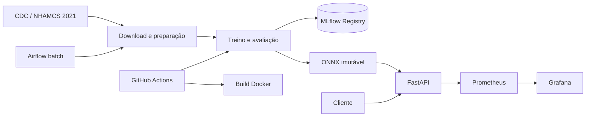

**Repositório público:**
[github.com/jrrrtricolor/FIAP-fase3-hospital-triage](https://github.com/jrrrtricolor/FIAP-fase3-hospital-triage)

**Versão candidata à avaliação:**
[`develop`](https://github.com/jrrrtricolor/FIAP-fase3-hospital-triage/tree/develop) —
a tag final será criada após as integrações obrigatórias

**Vídeo STAR:** **PENDENTE — falta fornecer a URL pública**

# Hospital Triage — FIAP Tech Challenge Fase 3

[](https://github.com/jrrrtricolor/FIAP-fase3-hospital-triage/actions/workflows/ml-pipeline.yml)

Sistema acadêmico de apoio à triagem hospitalar. A API recebe texto clínico em
inglês e retorna `normal`, `atencao` ou `urgente`, com probabilidades, versão do
modelo e latência. A solução usa NLP, FastAPI, ONNX Runtime, Docker, MLflow e
GitHub Actions.

> [!WARNING]
> Este protótipo não realiza diagnóstico, não substitui profissionais e não foi
> validado para uso clínico. Não envie dados pessoais ou identificáveis.

## Avaliação rápida com Docker

Pré-requisitos: Git e Docker 24+.

```bash
git clone https://github.com/jrrrtricolor/FIAP-fase3-hospital-triage.git
cd FIAP-fase3-hospital-triage
git switch develop
docker build -t hospital-triage:local .
docker run --rm --name hospital-triage -p 8000:8000 hospital-triage:local
```

Em outro terminal:

```bash
curl --fail http://localhost:8000/health
curl --fail http://localhost:8000/ready
curl --fail \
  --header 'Content-Type: application/json' \
  --data '{"clinical_text":"Severe chest pain and shortness of breath."}' \
  http://localhost:8000/predict
```

Resultado esperado: HTTP 200, classe `urgente`, probabilidades para as três
classes e `model_version` igual a `onnx-nhamcs-2021-v1`. O Swagger fica em
[http://localhost:8000/docs](http://localhost:8000/docs). Use `Ctrl+C` para
encerrar.

O container executa como usuário não root, possui healthcheck e carrega uma
única vez o ONNX versionado. Não depende de `mlflow.db`, dados locais ou conexão
externa para servir inferências.

## Entrega e status

| Item | Estado | Evidência ou pendência |
|---|---|---|
| Modelagem e otimização — 20% | Atendido | [Treino](src/hospital_triage/training.py), [comparação](model/mlflow_model_comparison.json), [ONNX](model/onnx_benchmark.json) e [Model Card](docs/model_card.md) |
| CI/CD — 15% | Atendido | [Workflow](.github/workflows/ml-pipeline.yml) e [execução verde](https://github.com/jrrrtricolor/FIAP-fase3-hospital-triage/actions/runs/33260221722) |
| Airflow — 15% | Em integração | DAG e evidência de execução ainda não versionadas |
| Monitoramento — 20% | Em integração | `/metrics`, Compose, Prometheus, Grafana e dashboard ainda não versionados |
| Documentação — 15% | Parcial | README e Model Card presentes; aguarda integrações e dados finais da entrega |
| Vídeo STAR — 15% | Não verificável | URL pública ainda não fornecida |
| DVC | Não atendido | `dvc.yaml` e `dvc.lock` ainda ausentes |
| API AWS | Bônus não implementado | Não contabilizado como requisito obrigatório |

Trabalho apenas planejado não é apresentado como concluído. Antes da release,
esta tabela deve ser atualizada com os comandos e links reais entregues pela
integração da equipe.

## Problema e arquitetura

O classificador estima a prioridade inicial a partir de informações disponíveis
na triagem. A inferência é real-time; aquisição, preparação, treino e retreino
são processos batch separados da API.



Airflow e a stack de observabilidade aparecem como arquitetura-alvo, mas estão
marcados como pendentes até a integração dos arquivos e testes.

### Decisão de nuvem

A opção para uma publicação futura é **Amazon ECR + AWS App Runner**. A API
stateless precisa responder durante a interação de triagem, enquanto treino e
retreino permanecem batch. Cada promoção deve produzir uma imagem imutável no
ECR. O deploy AWS é bônus e não está implementado.

## Dados, modelo e resultados

O projeto usa o
[NHAMCS Emergency Department 2021](https://www.cdc.gov/nchs/nhamcs/documentation/about-the-data-2021.html),
publicado pelo NCHS/CDC. O pipeline valida o checksum da fonte e cria
`clinical_text` em inglês a partir dos motivos da visita, idade, sexo, dor e
sinais vitais disponíveis na triagem. Diagnósticos, exames, medicamentos e
disposição não são features.

O target deriva de `IMMEDR`: níveis 1–2 são `urgente`, nível 3 é `atencao` e
níveis 4–5 são `normal`. Depois dos filtros há 10.495 registros e 10.492 textos
únicos. A divisão 70/15/15 usa `StratifiedGroupKFold`, seed 42 e hash do texto
para impedir leakage entre treino, validação e teste.

O modelo escolhido é TF-IDF com regressão logística balanceada. Ele superou o
candidato PyTorch em macro F1 de validação (`0,5582` contra `0,5349`).

| Resultado de validação/otimização | Valor |
|---|---:|
| Acurácia | 0,5709 |
| Macro F1 | 0,5582 |
| Recall de `urgente` | 0,5780 |
| Concordância Scikit-Learn × ONNX | 100% |
| Ganho de latência observado | 1,44x |
| Redução do artefato | 37,71% |

As métricas por classe, metodologia, limitações e riscos estão no
[Model Card](docs/model_card.md). Resultados estruturados:
[comparação dos modelos](model/mlflow_model_comparison.json) e
[benchmark ONNX](model/onnx_benchmark.json).

## API REST

| Método | Endpoint | Finalidade |
|---|---|---|
| `GET` | `/health` | Processo ativo |
| `GET` | `/ready` | Modelo carregado e versão |
| `POST` | `/predict` | Classe, probabilidades, versão e latência |
| `GET` | `/docs` | Swagger/OpenAPI |
| `GET` | `/metrics` | Em integração |

Entrada:

```json
{"clinical_text":"Severe chest pain and shortness of breath."}
```

Exemplo de resposta:

```json
{
  "target": "urgente",
  "probabilities": {
    "atencao": 0.2112,
    "normal": 0.0156,
    "urgente": 0.7732
  },
  "model_version": "onnx-nhamcs-2021-v1",
  "inference_time_ms": 1.45
}
```

O texto é obrigatório, recebe `trim`, aceita até 5.000 caracteres e não é
persistido nem escrito em logs pela aplicação.

## Desenvolvimento e reprodução

Pré-requisitos locais: Python 3.12, Poetry 2.4+ e aproximadamente 2 GB livres
para todos os grupos opcionais.

```bash
poetry env use 3.12
poetry install --with dev,notebooks,pipeline,optimization,training
```

### Dados e treino

```bash
poetry run python data/download_dataset.py
poetry run python -m src.hospital_triage.data_preparation
poetry run python -m src.hospital_triage.data_preparation --validate-only
poetry run python -m src.hospital_triage.training --git-sha local
```

Esses comandos baixam a fonte oficial, criam
`data/processed/training_data.db`, treinam, avaliam, convertem para ONNX e
registram a execução no MLflow. Dados, bancos, `mlruns/` e o Joblib local ficam
fora do Git.

### MLflow

```bash
poetry run mlflow db upgrade sqlite:///mlflow.db
poetry run mlflow ui \
  --backend-store-uri sqlite:///mlflow.db \
  --registry-store-uri sqlite:///mlflow.db \
  --host 127.0.0.1 \
  --port 5000
```

Acesse [http://localhost:5000](http://localhost:5000), abra
`hospital-triage-training` em **Experiments** e
`hospital-triage-text-classifier` em **Models**. A versão promovida usa o alias
`champion`. Faça backup de um banco antigo antes de executar a migração.

### Qualidade

```bash
poetry run ruff check src/hospital_triage tests
poetry run pytest tests ml_prep_kit/tests -v
```

Os testes cobrem dados, gates de modelo, MLflow, API e inferência com o mesmo
ONNX empacotado no Docker.

## CI/CD

O [workflow](.github/workflows/ml-pipeline.yml) executa em push e pull request
para `develop` e `main`. Ele instala dependências, executa Ruff e Pytest, baixa
e valida os dados, treina e registra o modelo, compartilha artefatos e constrói
a imagem Docker. O reusable workflow é fixado por SHA imutável e qualquer falha
interrompe o pipeline.

## Integrações pendentes

A integrante Júlia está desenvolvendo Airflow e monitoramento. A entrega só
poderá marcar esses itens como atendidos quando houver:

- DAG importável e idempotente com ingestão, preparação, treino, avaliação e
  registro, reutilizando os módulos existentes;
- `/metrics` sem texto clínico em labels, com chamadas, erros e duração;
- Compose com API, Prometheus e Grafana;
- provisioning reproduzível e dashboard com requisições, latência e erros;
- testes, comandos no README e evidências de execução.

O DVC também permanece pendente: a dependência existe, mas ainda faltam ao
menos três stages úteis em `dvc.yaml` e o respectivo `dvc.lock`.

## Evidências

| Evidência | Arquivo |
|---|---|
| Qualidade dos dados | [notebooks/00_data_quality_nhamcs_2021.ipynb](notebooks/00_data_quality_nhamcs_2021.ipynb) |
| EDA | [notebooks/01_eda_nhamcs_2021.ipynb](notebooks/01_eda_nhamcs_2021.ipynb) |
| Base de treino | [notebooks/02_training_data_analysis_nhamcs_2021.ipynb](notebooks/02_training_data_analysis_nhamcs_2021.ipynb) |
| Comparação Scikit-Learn × PyTorch | [notebooks/03_model_comparison_nhamcs_2021.ipynb](notebooks/03_model_comparison_nhamcs_2021.ipynb) |
| Model Card | [docs/model_card.md](docs/model_card.md) |
| ONNX final | [model/hospital_triage_model.onnx](model/hospital_triage_model.onnx) |

## Limitações essenciais

- `clinical_text` é texto templado, não narrativa clínica livre;
- somente inglês é suportado;
- os dados representam emergências dos Estados Unidos em 2021;
- não há validação prospectiva, externa, por subgrupo ou calibração clínica;
- o recall de `urgente` é insuficiente para automação;
- falsos negativos podem atrasar atendimento;
- mudanças de população e protocolo podem causar drift.

## Equipe e fechamento

- Cássio
- Júlia

Antes da entrega: incluir nomes completos e identificadores acadêmicos,
integrar e validar os itens pendentes, testar repositório e vídeo sem login e
criar uma tag imutável da versão avaliada.
